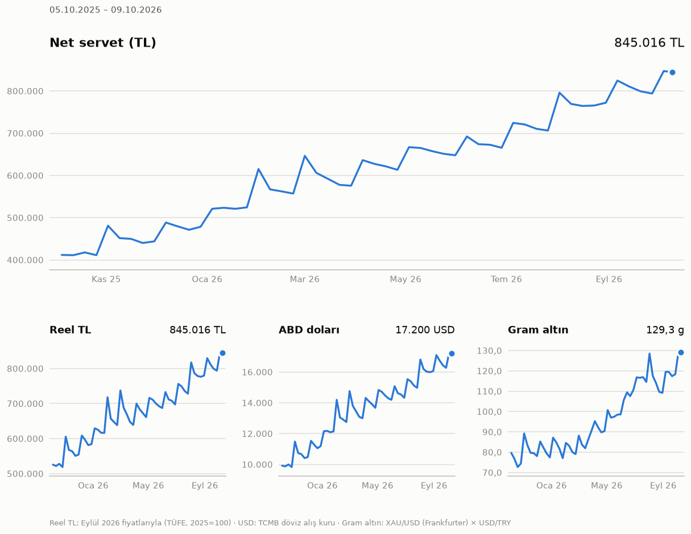

# Hane-Finans 00

Ailem ve kendim için kişisel finans programı. Hedef: kişisel bilanço ve net
servet, işlemler ve nakit akışı, nakit akışı tahmini, yatırım ve varlık
analizleri, borç yönetimi, matematiksel analiz ve senaryo motoru. Model olarak
Monarch ve Firefly III gibi uygulamalar alındı. Kullanılan modeller akademik
çalışmalara dayanıyor ve her birinin kaynağı belgelendi.

Proje sürüm sürüm ilerliyor. **00** temeli kuruyor: çift taraflı defter, kur,
altın ve TÜFE verileri, dört birimle net servet. Bu sürümde neler var:
[UPDATE_LOG.md](UPDATE_LOG.md). Yöntemler ve kaynaklar:
[docs/YONTEM.md](docs/YONTEM.md). Veri kaynakları:
[docs/VERI_KAYNAKLARI.md](docs/VERI_KAYNAKLARI.md).

- **Çift taraflı defter** (SQLite). Her işlem her birimde sıfıra kapanır. Döviz
  ve altın alım-satımı takas hesaplarıyla (Selinger) tutulur. Tutarlar `Decimal`
  olarak saklanır, hiçbir yerde float kullanılmaz.
- **Net servet dört birimle**:
  - TL (öne çıkan birim)
  - reel TL (TÜFE, son yayımlanan ayın fiyatlarıyla)
  - ABD doları (TCMB döviz alış kuru)
  - gram altın
- **Likidite katmanları** (anında, ≤ 1 hafta, kısıtlı, likit değil), kısa ve
  uzun vadeli borç ayrımı, kişiye göre kırılım (ben, babam, kardeşim, ortak).
- **Veri kaynakları**:
  - TCMB günlük kur bülteni (anahtarsız)
  - Frankfurter XAU/USD (anahtarsız, merkez bankası verisi)
  - TÜFE: EVDS3'ten (anahtarla) ya da TCMB'nin enflasyon tablosundan
  - pakette TÜFE kopyası (internetsiz de çalışır)
- **CSV içe aktarma**: standart biçim ya da sütun eşlemesiyle herhangi bir banka
  dökümü. Mükerrer satır kontrolü var, içe aktarma "ya hep ya hiç" çalışır.
  Kategori kuralları satırları otomatik sınıflar.
- **Komut satırı** (`finans …`), net servet grafiği (PNG), denemek için uydurma
  bir örnek hane.
- **Testler**: 106 pytest testi. Aralarında rastgele defterlerle defter
  kurallarını sınayan özellik testleri ve TÜİK'in gerçek serisiyle TÜFE
  doğrulaması var.



## Hızlı başlangıç

```bash
python3 -m venv --system-site-packages .venv
.venv/bin/pip install -e ".[dev]"     # sqlalchemy, pandas, httpx, typer, rich, matplotlib, pytest, hypothesis
.venv/bin/finans baslat               # ~/.local/share/hane-finans/defter.sqlite
.venv/bin/finans ornek                # ayrı bir örnek defter (uydurma hane, gerçek fiyatlar)
.venv/bin/finans -d ~/.local/share/hane-finans/ornek.sqlite bilanco
.venv/bin/python -m pytest
```

`finans ornek --sentetik` internet olmadan, uydurma fiyatlarla çalışır.
Sonraki örneklerde `.venv/bin/` kısaltıldı.

## Kullanım

Hesap adları `:` ile ayrılmış bir yoldur. İlk bölüm `Varlık`, `Borç`,
`Özkaynak`, `Gelir` ya da `Gider` olmalıdır. Türkçe harfsiz de yazılabilir
(`varlik:banka`). Komutlarda hesabın tam adı yerine benzersiz bir parçası
yeterlidir: `Market` → `Gider:Gıda:Market`.

```bash
# Hesaplar (türler için: finans hesap turler)
finans hesap ekle "Varlık:Banka:Ziraat Vadesiz" --tur vadesiz --kurum "Ziraat Bankası" --sahip Ben
finans hesap ekle "Varlık:Döviz:USD Hesabı" --tur doviz --birim USD
finans hesap ekle "Varlık:Altın:Gram" --tur altin                  # birim: XAU_G (24 ayar, gram)
finans hesap ekle "Borç:Kredi Kartı:Bonus" --tur kredi_karti
finans hesap ekle "Gider:Gıda:Market"
finans hesap ekle "Gelir:Maaş"

# Açılış bakiyeleri (doğal işaretle: borçta borç tutarı pozitif yazılır)
finans acilis "Ziraat Vadesiz" 25000 --tarih 2026-10-01
finans acilis Bonus 3500 --tarih 2026-10-01

# Günlük işlemler (tutarlar 1.234,56 ya da 1234.56 yazılabilir)
finans gelir 65000 Maaş --hedef "Ziraat Vadesiz"
finans harcama 450,75 Market --kaynak Bonus --karsi-taraf Migros
finans transfer 3500 --kaynak "Ziraat Vadesiz" --hedef Bonus              # kart borcu ödemesi
finans degisim --kaynak "Ziraat Vadesiz" --verilen 49126,70 --hedef "USD Hesabı" --alinan 1000
finans islem ekle --aciklama "Kredi taksiti" -s "Borç:Kredi:İhtiyaç=3000" -s "Gider:Faiz=1500" -s "Ziraat Vadesiz"

# Fiyatlar ve raporlar
finans fiyat guncelle                  # TCMB kurları, altın, TÜFE; eksik günleri tamamlar
finans bilanco                         # bugünkü bilanço; --tarih, --kisi Babam
finans servet --siklik ay              # net servetin seyri (TL, reel TL, USD, gram altın); --csv
finans grafik                          # ~/.local/share/hane-finans/cikti/net_servet.png
finans tufe                            # son 13 ayın TÜFE'si
finans yedekle                         # ~/.local/share/hane-finans/yedek/
```

### İçe aktarma (CSV)

Standart biçimde `;` ayırıcı ve ondalık virgül kullanılır. Başlıklar aşağıdaki
gibidir; sütunların sırası önemli değildir. Örnek dosya:
[ornek/islemler_standart.csv](ornek/islemler_standart.csv).

```
tarih;aciklama;tutar;hesap;karsi_hesap;birim;karsi_taraf;not
2026-10-01;MİGROS KONYA;-450,00;Bonus;;;Migros;
2026-10-02;Maaş;65.000,00;Ziraat Vadesiz;Gelir:Maaş;;;
```

`tutar`, `hesap`'taki değişimi hesap sahibinin gözünden gösterir:

- Negatif: para çıkışı. Kredi kartıyla yapılan alışveriş de buna dahildir.
- Pozitif: para girişi.

`karsi_hesap` boş bırakılırsa satırı kategori kuralları sınıflar. Hiçbir kural
uymazsa satır `Gider:Kategorisiz` ya da `Gelir:Kategorisiz` hesabına gider.

Bir bankanın kendi dökümü için sütunlar eşlenir:

```bash
finans iceaktar ekstre.csv --hesap "Ziraat Vadesiz" --atla 2 --tarih-bicimi "%d.%m.%Y" \
    --sutunlar "tarih=İşlem Tarihi,aciklama=Açıklama,cikis=Borç,giris=Alacak" --deneme
```

- `--deneme`: hiçbir şey yazmadan önizler.
- Aynı dosya ya da üst üste binen dökümler yeniden aktarılırsa aynı satırlar
  ikinci kez eklenmez.
- Hatalı bir satır varsa hiçbir satır yazılmaz ve tüm hatalar listelenir.
- Kodlama otomatik bulunur (UTF-8, Windows-1254, ISO-8859-9); gerekirse
  `--kodlama` ile verilebilir.

### Kurallar

```bash
finans kural ekle migros Market                    # açıklamada "migros" geçerse → Gider:Gıda:Market
finans kural ekle "kahve\s+dunyasi" Kahve --regex
finans kural uygula                                # kategorisiz işlemlere kuralları uygular
```

### EVDS anahtarı (isteğe bağlı)

Anahtar olmadan da her şey çalışır. Anahtar varsa TÜFE resmî endeks
seviyeleriyle gelir ve geçmiş kurlar tek istekte iner.

1. https://evds3.tcmb.gov.tr adresinde üye olun.
2. Profil sayfasındaki API anahtarını kopyalayın.
3. Anahtarı kaydedin: `finans ayar evds-anahtari ANAHTAR`. Anahtar
   `~/.config/hane-finans/ayarlar.toml` dosyasına yalnızca sizin
   okuyabileceğiniz izinle (0600) yazılır.

## Örnek çıktı

Uydurma bir hane, gerçek kur ve altın fiyatları (`finans ornek`, 09.10.2026):

```
╭─ Net servet ────────────────────────────────────────────────────────────────────────────────────────────╮
│ TL                      845.015,52                                                                      │
│ Reel TL                 845.015,52   Eylül 2026 fiyatlarıyla; sonrası için TÜFE henüz yok               │
│ USD                      17.200,49   49,1274 TL · 09.10.2026 · TCMB döviz alış                          │
│ Gram altın                129,27 g   6.536,75 TL/g · 09.10.2026 · Frankfurter XAU/USD × TCMB döviz alış │
╰─────────────────────────────────────────────────────────────────────────────────────────────────────────╯
```

`finans servet` aynı serveti zaman içinde gösterir. Bu hanenin serveti bir yılda
TL olarak %105, reel olarak %63, dolar olarak %75 arttı. Gram altın olarak
artış %69'da kaldı ve Aralık'tan Ocak'a 79 g'dan 73 g'a düştü: o ay altın,
hanenin birikiminden hızlı değer kazandı. Dört birim bu yüzden birlikte
gösteriliyor.

## Klasör yapısı

| Modül | İçerik |
|---|---|
| `hane_finans/core/` | Saf hesaplar, veritabanı ve ağ kullanmaz: tutarlar (`money`), tarihler, metin katlama, hesap türleri ve likidite (`kinds`), fiyat defteri (`prices`), TÜFE (`inflation`), değerleme ve net servet (`valuation`) |
| `hane_finans/ledger/` | SQLAlchemy modelleri, veritabanı, hesaplar, işlem kuralları (`transactions`), bakiye sorguları |
| `hane_finans/prices/` | TCMB XML, Frankfurter, EVDS3, TCMB TÜFE tablosu istemcileri; saklama ve güncelleme |
| `hane_finans/ingest/` | CSV içe aktarma, kategori kuralları |
| `hane_finans/reports/` | Bilanço, net servet serisi, grafik |
| `hane_finans/cli.py` | Komut satırı (`finans`) |
| `hane_finans/demo.py` | Uydurma örnek hane |
| `hane_finans/data/` | Pakete eklenen kamuya açık veri: TÜFE kopyası ([açıklama](hane_finans/data/README.md)) |
| `tests/` | pytest + Hypothesis; `fixtures/` içinde kaydedilmiş gerçek TCMB ve Frankfurter yanıtları |
| `docs/` | Yöntem, veri kaynakları, örnek grafik |

## Veri ve gizlilik

Depo herkese açık, bu yüzden **kişisel veri asla depoya girmez**.

- **Konum:** defter, yedekler ve grafikler depo dışında,
  `~/.local/share/hane-finans/` altında tutulur. `-d` ya da `HANE_FINANS_VT`
  ile başka bir dosya seçilebilir.
- **.gitignore:** `*.sqlite`, `yedek/`, `cikti/`, `ayarlar.toml` gibi kalıpları
  ikinci bir güvenlik ağı olarak dışarıda tutar.
- **İzinler:** defter, yedekler ve ayar dosyası 0600 izniyle, yalnızca kullanıcı
  tarafından okunabilir oluşturulur.
- **Örnek veri:** `finans ornek` gerçek deftere asla yazmaz.
- **Şifreleme:** defter dosyası şu an ayrıca şifrelenmiyor. Diskin şifreli
  olması (örneğin LUKS) önerilir. Dosyanın kendisinin şifrelenmesi (SQLCipher)
  sonraki adımlar arasında.

## Tasarım ilkeleri

İlk değerlendirmedeki "dikkat edilecekler" maddeleri ve bu sürümdeki
karşılıkları:

1. **En büyük risk veri girişi.** Türkiye'de açık bankacılık (ÖHVPS) yalnızca
   lisanslı kuruluşlara açık. Bu yüzden ekstre içe aktarma baştan ciddiye
   alındı:
   - **00:** sütun eşlemeli CSV, mükerrer kontrolü, kurallar, "ya hep ya hiç"
     içe aktarma.
   - **01:** bankaya özel şablonlar ve öğrenen kategorizasyon.
2. **Etkin sınır hane ölçeğinde kırılgan** (Michaud 1989; DeMiguel ve ark.
   2009). 05'te büzme (Ledoit-Wolf), yeniden örnekleme, 1/N kıyası ve zamana
   göre doğrulama ile gösterilecek. Bunlar tavsiye değil, betimleme olacak.
3. **Neyin ne kadar güncel olduğu açıkça yazılmalı.** Her değer fiyat tarihi ve
   kaynağıyla gösteriliyor. 7 günden eski fiyatlar ve fiyatı olmayan varlıklar
   uyarı verir; tahmin edilmez, net servete katılmaz. TÜFE'nin hangi aya kadar
   bilindiği de yazılıyor.
4. **Enflasyon her şeyi "anormal" gösterir.** Reel TL bu sürümde var. Tahmin
   (06) ve anomali tespiti (07) reel tutarlarla yapılacak.
5. **Gizlilik.** Yukarıdaki "Veri ve gizlilik" bölümüne bakın.

## Yol haritası

| Sürüm | İçerik | Durum |
|---|---|---|
| **00** | Defter, hesaplar, elle giriş, CSV içe aktarma ve kurallar, TCMB, altın ve TÜFE, dört birimle net servet, likidite | ✅ bu sürüm |
| **01** | Banka ve kart şablonları, **taksit modeli**, nakit akışı ve gelir tablosu, Sankey, tekrarlayan ödemeler, hane finans oranları, servet değişiminin ayrıştırılması, öğrenen kategorizasyon | sıradaki |
| **02** | Borç modülü: ödeme planı, gerçek kredi maliyeti (IRR), avalanche ve snowball, peşin mi taksit mi, reel borç yükü | |
| **03** | Yatırım: TEFAS ve BIST fiyatları, TWR ve XIRR, reel getiri, oynaklık, maksimum düşüş, VaR ve CVaR ile geri testleri, korelasyon, yoğunlaşma | |
| **04** | Duvar monitörü (kiosk), misafir modu | ⏸ şimdilik ertelendi |
| **05** | Portföy teorisi: etkin sınır, GMV, teğet portföy, HRP, 1/N | |
| **06** | Nakit akışı tahmini: kesin akışlar ve istatistiksel tahmin, tahmin aralıkları, geri test | |
| **07** | Anomali tespiti | |
| **08** | Senaryo motoru: senaryolar, duyarlılık (Sobol), Monte Carlo, tarihsel stres testi | |
| **09** | Kişisel enflasyon, hedefler, bütçe | |
| **10** | Yapay zeka: MCP sunucusu, haftalık özet, PDF ekstre okuma | ⏸ şimdilik ertelendi |

## Fikir havuzu: benzer uygulamalardan alınacaklar

Bu fikirlerin hepsi zamanla programa eklenecek. Beğenilmeyen olursa değişecek
ya da geliştirilecek. Durum: ✅ var, ◐ kısmen, ☐ planlandı, ⏸ ertelendi.

| Kaynak | Fikir | Sürüm | Durum |
|---|---|---|---|
| Monarch Money | Sankey nakit akışı diyagramı | 01 | ☐ |
| | Ödeme ve abonelik takvimi | 01 | ☐ |
| | Ortak hane kullanımı | 00 | ◐ hesap sahibi ve kişiye göre bilanço var; ayrı kullanıcı girişi yok |
| | "Bu ay neden değişti?" açıklaması | 01 / 10 | ☐ önce sayısal ayrıştırma, sonra yapay zekayla anlatım |
| | Haftalık özet | 10 | ⏸ |
| | Gelecek tahmini | 06 | ☐ |
| Firefly III | Çift taraflı defter | 00 | ✅ |
| | Kural motoru | 00 / 01 | ◐ açıklama ya da regex → hesap; tutar ve karşı taraf koşulları sonra |
| | Beklenen faturalar | 01 | ☐ |
| | Tasarruf hedefleri ("kumbara") | 09 | ☐ |
| | REST API | web arayüzüyle | ☐ |
| | Ayrı içe aktarma aracı | 00 / 01 | ◐ CSV ve sütun eşleme; bankaya özel şablonlar 01 |
| Actual Budget | Zarf bütçeleme | 09 | ☐ |
| | Zamanlanmış işlemler | 01 | ☐ |
| | Kendi raporunu tasarlama | sonra | ☐ |
| Sure (Maybe) | Modern net servet arayüzü | web arayüzüyle | ☐ |
| | Yapay zeka ajanlarına erişim | 10 | ⏸ |
| Ghostfolio | X-ray: yoğunlaşma kuralları (kurum, para birimi, tek varlık; TMSF sınırı) | 03 | ☐ |
| | Rakamları gizleme (Zen mode) | 04 | ⏸ monitörün misafir modu |
| Wealthfolio | TWR ve MWR birlikte | 03 | ☐ |
| | Dönem değişimini kaynaklarına ayırma (gelir, kazanç, ücret, vergi, kur) | 01 | ☐ takas hesapları bu sürümde hazır |
| | API anahtarlarını işletim sistemi anahtarlığında tutma | sonra | ☐ şimdilik 0600 izinli ayar dosyası |
| Portfolio Performance | TTWROR, IRR, maksimum düşüş ve süresi; hesapları doğrulamak için referans | 03 | ☐ |
| Beancount, smart_importer | Geçmiş düzeltmelerden öğrenen kategorizasyon | 01 | ☐ |
| hledger | `roi`: TWR ve IRR yan yana | 03 | ☐ |
| | Tekrarlayan işlemlerden tahmin | 06 | ☐ |
| | Bilanço, nakit akışı, gelir tablosu | 00 / 01 | ◐ bilanço var |
| Paisa | Fatura takvimi | 01 | ☐ |
| | Hedefler | 09 | ☐ |
| | Defter verisiyle hesap tablosu | sonra | ☐ |
| ezBookkeeping | Raspberry Pi'de çalışacak hafiflik | 04 | ⏸ |
| | Fiş okuma (OCR), MCP | 10 | ⏸ |
| Rotki | Şifreli defter (SQLCipher) | sonra | ☐ şimdilik disk şifrelemesi ve 0600 izin |
| | Hassas olmayan fiyat verisini ayrı tutma | sonra | ☐ |
| ProjectionLab | Monte Carlo ve tarihsel geri test | 08 | ☐ |
| | Tek tek denemeleri inceleme, hedefe ulaşma olasılığı | 08 / 09 | ☐ |

## Bu sürümde yapılmayanlar

### İlk değerlendirmeden (sonraki sürümlere)

Taksit modeli, nakit akışı, borç modülü, yatırım analizleri, portföy teorisi,
tahmin, anomali tespiti, senaryo motoru, kişisel enflasyon. Hangi sürümde
geleceği yol haritasında yazıyor. Duvar monitörü ve yapay zeka bilerek
ertelendi.

### 00 yapılırken fark edilenler

- **Banka şablonları yok.** Hangi bankaların kullanıldığı ve ekstrelerin hangi
  biçimde indirilebildiği henüz bilinmiyor. Şimdilik genel CSV ve sütun
  eşleme var. Excel (`.xlsx`) ve PDF ekstre okunamıyor.
- **EVDS gerçek anahtarla denenmedi.** İstemci; TCMB'nin belgeleri, anahtarsız
  isteğin döndürdüğü hata ve yayımlanmış gerçek yanıt örneklerine göre yazıldı
  ve test edildi. Anahtar alındığında bir kez canlı denenmeli.
- **Altın fiyatı uluslararası pariteden geliyor:** XAU/USD × USD/TRY.
  - Kapalıçarşı ya da banka fiyatı değil; aradaki prim ve makas yok.
  - Çeyrek, yarım gibi ziynet altınlar ve 22 ayar için çevirme yok.
  - Frankfurter'ın değeri yaklaşık on dört merkez bankasının ortalaması; tek
    tek bankalar ±%1 sapabiliyor.
- **Geçmiş kurlar EVDS anahtarı olmadan yavaş iniyor:** TCMB'den her gün için
  bir istek gidiyor, bir yıl yaklaşık 1,5 dakika sürüyor. Anahtarla tek istek
  yeterli.
- **TEFAS fonları ve BIST hisseleri** için fiyat otomatik gelmiyor;
  `finans fiyat ekle` ile elle girilebilir.
- **Reel TL son yayımlanan TÜFE ayında kalıyor.** Bugünün değeri o ayın
  fiyatlarıyla gösteriliyor, çünkü sonraki enflasyon henüz bilinmiyor.
  TÜFE'nin TCMB tablosundan zincirlenmesi yuvarlama nedeniyle en fazla 0,04
  puan sapıyor (bkz. YONTEM.md).
- **Veritabanı göçleri yok.** Şema sürümü `meta` tablosunda tutuluyor; şema
  değiştiğinde Alembic eklenmeli.
- **Kullanıcı arayüzü yalnızca komut satırı.** Web arayüzü ve çok kullanıcılı
  giriş yok.

## Sonraki adımlar (01 önerisi)

1. **Banka ve kart şablonları:** araştırılan bankaların CSV, Excel ya da PDF
   ekstreleri için hazır eşlemeler ve `.xlsx` okuma.
2. **Taksit modeli:** taksitli alışveriş alındığı gün borç olarak yazılsın,
   ödemeleri aylara yayılsın; "gelecek ayların taksit yükü" gösterilsin.
3. **Nakit akışı ve gelir tablosu:** kategori ve ay bazında. Sankey diyagramı.
4. **Tekrarlayan ödeme ve abonelik tespiti**, ödeme takvimi.
5. **Hane finans oranları:** acil durum fonu (kaç ay dayanılır), tasarruf
   oranı, borç/gelir, borç servisi oranı.
6. **Servet değişiminin ayrıştırılması:** net tasarruf + fiyat etkisi + kur
   etkisi. Takas hesapları bunun için hazır.
7. **Öğrenen kategorizasyon:** geçmiş düzeltmelerden öğrenen bir model
   (smart_importer yaklaşımı).
